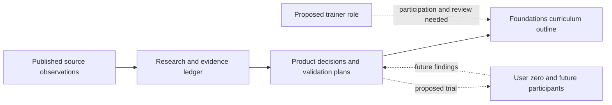
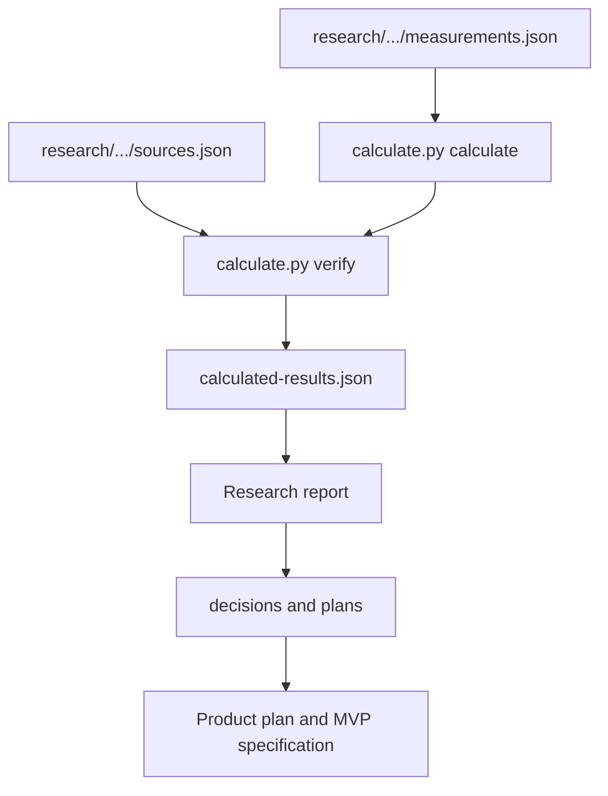
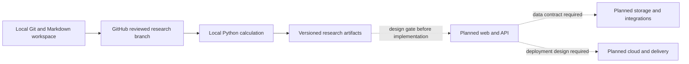

# Personal Fitness OS: architecture and diagrams

Scope: `product:personal-fitness-os`. Reviewed 2026-10-06 (America/Los_Angeles; verification 2026-10-07 UTC). Source revision: `7098daf7aee751bd67cfec1d434b5448b93bac97`. Prepared by Codex from repository evidence; accountable owner review remains pending.

Source authority: [durable context](../context.md), [README](../../README.md), [canonical product plan](../../plans/personal-fitness-os-product-plan.md) and [validation Project](../projects/personal-fitness-os-validation.md). The dated [backfill report](reports/2026-10-06-backfill-C0-C2.md) scopes verification.

## Business problem and present capability

The Product tests whether a coherent, adaptive planning and education workflow helps people act on fragmented fitness information. [The canonical plan](../../plans/personal-fitness-os-product-plan.md) owns the full business narrative, roles, hypotheses and staged validation. The repository implements research, calculations, curriculum outlines and product plans. The README explicitly says the user-zero prototype is specified, not built; the curriculum is prepared rather than fully written or reviewed.

| Boundary | Canonical identity/type | Evidence and state |
| --- | --- | --- |
| Research/course source | `personal-fitness-os-research-and-course`; `content.research-and-curriculum` | [plans](../../plans) and [research](../../research); draft artifacts |
| Web/API and storage | `personal-fitness-os-web`, `-api`, `-database` | Planned `application.web`, `service.api`, `data.relational`; no runtime implementation here |
| Integrations | `personal-fitness-os-auth`, `-billing`, `-ai`, `-notifications`, `-analytics` | Planned service Components; no live credentials, integration or account asserted |
| Delivery/supporting scope | `personal-fitness-os-cloud-infrastructure`, `-delivery-pipeline`, `-observability`, `-growth` | Planned infrastructure, pipeline and growth Components; not deployment evidence |

The planned Components are canonical inventory, not authorization to create services. The bounded validation Project remains distinct from this durable Product.

## System context

Implemented research flow in solid edges; user workflow remains proposed.

## Source and calculation code

Implemented local toolchain. The script uses Python standard-library JSON and pathlib, verifies recorded inputs and writes one derived result file.

## Current environment and planned runtime boundary

The only inspected execution environment is a local research checkout; GitHub retains source. No staging/production topology is implemented in this repository.

Research inputs contain aggregate source observations; participant health records belong in a future explicitly approved protected data workflow, not Git or MetadataDB. The proposed Cronometer handoff and AI assistance in the MVP are design requirements, not implemented connections. Current app HA, uptime, backups of server databases and DR are not applicable. Their targets and architecture must be set at the future C1 gate, without copying provider availability claims as measured Product performance.
